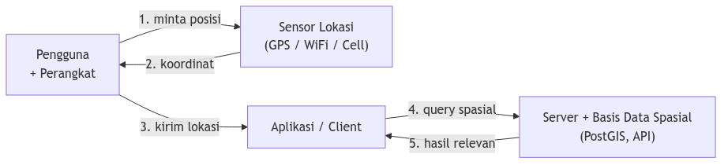
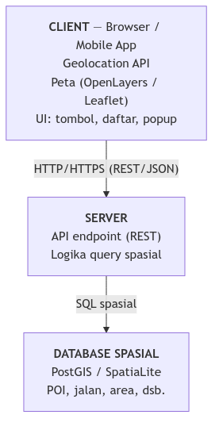

# LBS & Mobile GIS
## Location-Based Services di Web & Mobile

Program Sarjana Terapan Teknologi Survei dan Pemetaan Dasar
Departemen Teknologi Kebumian
Sekolah Vokasi, UGM

<hr>

**Ismail Sunni** | Geospatial Software Engineer | Camptocamp DE

---

# Presentasi Ini

[https://github.com/ismailsunni/web-gis-2026](https://github.com/ismailsunni/web-gis-2026)


---

# Recap: Sudah Sampai Mana Kita

**Minggu sebelumnya:**
- WebGIS vs Desktop GIS, Maps API (OpenLayers)
- Standar OGC: WMS & WFS, server pemetaan

**Hari ini (CPMK-3):**
- Bagaimana web/aplikasi tahu **di mana pengguna berada**?
- Konsep **LBS** (Location-Based Services)
- **HTML Geolocation API**, alur kerja LBS di mobile, dan arsitektur aplikasi LBS sederhana

---

# Tujuan Pembelajaran

Setelah sesi ini, mahasiswa mampu:

✅ Menjelaskan **konsep LBS** dan komponen penyusunnya
✅ Menggunakan **HTML Geolocation API** untuk mengambil posisi pengguna
✅ Menjelaskan **alur kerja** layanan berbasis lokasi pada perangkat mobile
✅ Merancang **arsitektur aplikasi LBS sederhana**
✅ Memahami isu **akurasi, privasi, dan baterai**

---

# Outline

1. **Apa itu LBS?** — konsep & contoh
2. **Komponen LBS** — anatomi sebuah layanan
3. **Sumber Lokasi** — GPS, WiFi, Cell, IP
4. **HTML Geolocation API** — ambil posisi di browser
5. **Alur Kerja LBS di Mobile** — langkah demi langkah
6. **Arsitektur Aplikasi LBS** — client, server, data
7. **Privasi, Akurasi & Baterai**
8. **Demo & Debug LBS** — DevTools Sensors + HP asli (fake GPS)
9. **Wrap-up** & Q&A

---

# 1️⃣ Apa itu LBS?

---

# Location-Based Services (LBS)

**LBS** = layanan yang memanfaatkan **posisi geografis** pengguna untuk memberikan informasi atau fungsi yang relevan.

> "Layanan yang jawabannya **berbeda** tergantung **di mana** kamu berada."

**Pertanyaan inti yang dijawab LBS:**
- 📍 Di mana saya sekarang?
- 🔎 Apa yang ada **di dekat** saya?
- 🧭 Bagaimana cara ke sana?
- 🔔 Beri tahu saya saat saya **masuk/keluar** area tertentu

---

# Contoh LBS Sehari-hari

| Aplikasi | Pemanfaatan Lokasi |
|---|---|
| 🗺️ Google Maps | Navigasi, "restoran terdekat" |
| 🛵 Gojek / Grab | Cari driver terdekat, ETA |
| 📦 Shopee / paket | Lacak posisi kurir realtime |
| 🌧️ BMKG / cuaca | Prakiraan untuk lokasi kamu |
| 🏃 Strava | Rekam jejak (track) lari/sepeda |
| 🔔 Reminder lokasi | "Ingatkan beli kopi saat dekat toko" |

> Hampir semua aplikasi mobile populer punya **fitur LBS**.

---

# Dua Mode LBS

| Mode | Penjelasan | Contoh |
|---|---|---|
| **Reactive (pull)** | Pengguna **meminta** info berdasarkan lokasi | "Cari ATM terdekat" |
| **Proactive (push)** | Sistem **otomatis** bertindak saat kondisi lokasi terpenuhi | Notifikasi promo saat lewat mall (geofencing) |

> **Geofencing** = memicu aksi saat pengguna masuk/keluar batas area virtual.

---

# 2️⃣ Komponen LBS

---

# Anatomi Sebuah Layanan LBS



**Lima komponen klasik LBS:**
1. **Perangkat** (HP, browser)  2. **Jaringan** (internet/seluler)
3. **Penyedia posisi** (GPS, WiFi, dll.)  4. **Penyedia konten/data** (peta, POI)
5. **Aplikasi/Service** (logika & tampilan)

---

# 3️⃣ Sumber Lokasi

---

# Dari Mana Posisi Berasal?

| Sumber | Akurasi | Catatan |
|---|---|---|
| 🛰️ **GPS / GNSS** | 5–10 m | Akurat, butuh langit terbuka, boros baterai |
| 📶 **WiFi** | 20–50 m | Cocok indoor, pakai database hotspot |
| 📡 **Cell tower** | 100–1000 m | Selalu ada sinyal seluler, kasar |
| 🌐 **IP Address** | kota/wilayah | Sangat kasar, untuk web tanpa GPS |
| 🔵 **Bluetooth / Beacon** | < 5 m | Micro-location indoor (mall, museum) |

> Perangkat sering **menggabungkan** beberapa sumber → *hybrid positioning*.

---

# A-GPS & Hybrid Positioning

**A-GPS (Assisted GPS):** perangkat memakai data jaringan seluler untuk mempercepat fix GPS (dari menit → detik).

**Hybrid:** OS menggabungkan GPS + WiFi + Cell + sensor untuk hasil terbaik.

```
Butuh akurat & di luar ruang  → GPS dominan
Indoor / hemat baterai        → WiFi + Cell
Hanya perlu kota/wilayah      → IP geolocation
```

> Sebagai developer, kita **tidak memilih sumbernya** — OS/browser yang menentukan. Kita hanya minta tingkat akurasi.

---

# 4️⃣ HTML Geolocation API

---

# HTML Geolocation API

API standar **browser** untuk mengakses lokasi pengguna — tanpa library, tanpa plugin.

```javascript
if ("geolocation" in navigator) {
  navigator.geolocation.getCurrentPosition(
    onSuccess,   // callback saat berhasil
    onError,     // callback saat gagal
    options      // konfigurasi
  );
} else {
  console.log("Geolocation tidak didukung browser ini");
}
```

- Tersedia di hampir semua browser modern
- **Wajib HTTPS** (atau `localhost`) — alasan keamanan
- Selalu minta **izin pengguna** dulu

---

# `getCurrentPosition`: Sekali Ambil

```javascript
navigator.geolocation.getCurrentPosition(
  (position) => {
    const lat = position.coords.latitude;
    const lon = position.coords.longitude;
    const acc = position.coords.accuracy; // dalam meter
    console.log(`Posisi: ${lat}, ${lon} (±${acc} m)`);
  },
  (error) => {
    console.error("Gagal:", error.message);
  },
  {
    enableHighAccuracy: true,  // pakai GPS jika ada
    timeout: 10000,            // batas tunggu (ms)
    maximumAge: 0              // jangan pakai cache
  }
);
```

---

# Objek `position` & `coords`

| Properti | Arti |
|---|---|
| `coords.latitude` | Lintang (derajat) |
| `coords.longitude` | Bujur (derajat) |
| `coords.accuracy` | Akurasi horizontal (meter) |
| `coords.altitude` | Ketinggian (m, bisa `null`) |
| `coords.heading` | Arah hadap (derajat dari utara) |
| `coords.speed` | Kecepatan (m/s) |
| `timestamp` | Waktu pengukuran |

> Koordinat selalu **EPSG:4326 (WGS 84)** — lon/lat derajat desimal.

---

# `watchPosition`: Pantau Terus-menerus

Untuk navigasi / tracking — dipanggil setiap posisi berubah.

```javascript
const watchId = navigator.geolocation.watchPosition(
  (position) => {
    updateMarker(position.coords.latitude,
                 position.coords.longitude);
  },
  (error) => console.error(error),
  { enableHighAccuracy: true }
);

// Hentikan saat tidak perlu — hemat baterai!
navigator.geolocation.clearWatch(watchId);
```

> Selalu `clearWatch()` saat selesai → kalau tidak, GPS terus menyala.

---

# Menangani Error

```javascript
function onError(error) {
  switch (error.code) {
    case error.PERMISSION_DENIED:
      alert("Pengguna menolak akses lokasi");      break;
    case error.POSITION_UNAVAILABLE:
      alert("Informasi lokasi tidak tersedia");    break;
    case error.TIMEOUT:
      alert("Permintaan lokasi timeout");          break;
  }
}
```

**Selalu siapkan rencana cadangan:**
- Izin ditolak → minta input manual / pakai lokasi default
- Timeout → coba lagi dengan `enableHighAccuracy: false`

---

# Izin & Keamanan

🔒 **Geolocation hanya jalan di context aman:**
- `https://` atau `http://localhost`
- Browser **selalu** menampilkan dialog izin

🔑 **Status izin bisa dicek (Permissions API):**

```javascript
navigator.permissions.query({ name: "geolocation" })
  .then((result) => {
    console.log(result.state); // "granted" | "prompt" | "denied"
  });
```

> Hormati keputusan pengguna. Jangan minta lokasi sebelum benar-benar dibutuhkan.

---

# 5️⃣ Alur Kerja LBS di Mobile

---

# Alur Kerja LBS: Langkah demi Langkah

1. Pengguna **buka aplikasi** / fitur lokasi
2. Aplikasi **minta izin** akses lokasi → *(granted)*
3. OS **aktifkan sensor** → tentukan posisi (GPS / WiFi / Cell)
4. Aplikasi **terima koordinat** (lat, lon, accuracy)
5. **Kirim koordinat** ke server (query spasial)
6. Server **cari data relevan** (POI terdekat, dsb.)
7. **Tampilkan hasil** di peta / daftar ke pengguna
8. *(opsional)* **`watchPosition`** → ulangi dari langkah 4 saat bergerak

---

# Contoh Konkret: "Warung Makan Terdekat"

1. Buka aplikasi → tombol **"Cari di sekitar saya"**
2. Dialog izin lokasi → pengguna **Allow**
3. `getCurrentPosition` → `-7.77, 110.38` (±15 m)
4. Kirim ke server: `GET /api/warung?lat=-7.77&lon=110.38&radius=1000`
5. Server query PostGIS:
   ```sql
   SELECT nama, ST_Distance(geom, :titik) AS jarak
   FROM warung
   WHERE ST_DWithin(geom, :titik, 1000)
   ORDER BY jarak LIMIT 10;
   ```
6. Kembalikan GeoJSON → tampilkan marker + daftar terurut jarak

---

# 6️⃣ Arsitektur Aplikasi LBS

---

# Arsitektur LBS Sederhana



---

# Pembagian Tanggung Jawab

| Lapisan | Tugas |
|---|---|
| **Client** | Ambil lokasi (Geolocation), tampilkan peta, kirim request |
| **Server / API** | Terima koordinat, jalankan logika, query data |
| **Database spasial** | Simpan & cari data berdasarkan jarak/area (`ST_DWithin`, `ST_Distance`) |
| **(opsional) Map server** | Sajikan basemap / layer (WMS/WFS dari minggu lalu) |

> Untuk demo, **client-only** pun cukup: data POI bisa inline GeoJSON + hitung jarak di JavaScript.

---

# Versi Paling Sederhana (Client-Only)

Tanpa server — cukup untuk belajar konsep:

```javascript
navigator.geolocation.getCurrentPosition((pos) => {
  const me = [pos.coords.longitude, pos.coords.latitude];
  // Hitung jarak ke tiap POI (data inline), urutkan, tampilkan
  poiList.forEach(p => p.jarak = haversine(me, [p.lon, p.lat]));
  poiList.sort((a, b) => a.jarak - b.jarak);
  renderDaftar(poiList.slice(0, 5));
  tampilkanDiPeta(me, poiList);
});
```

> Konsep LBS lengkap **tanpa backend** — ideal untuk latihan.

---

# Menghitung Jarak: Haversine

Jarak antar dua titik lat/lon di permukaan bumi:

```javascript
function haversine([lon1, lat1], [lon2, lat2]) {
  const R = 6371; // radius bumi (km)
  const toRad = (d) => d * Math.PI / 180;
  const dLat = toRad(lat2 - lat1);
  const dLon = toRad(lon2 - lon1);
  const a = Math.sin(dLat/2)**2 +
            Math.cos(toRad(lat1)) * Math.cos(toRad(lat2)) *
            Math.sin(dLon/2)**2;
  return R * 2 * Math.atan2(Math.sqrt(a), Math.sqrt(1-a));
}
```

> Untuk data banyak / area luas → serahkan ke **PostGIS** (`ST_Distance`).

---

# 7️⃣ Privasi, Akurasi & Baterai

---

# ⚠️ Privasi: Lokasi = Data Sensitif

Lokasi pengguna bisa mengungkap **rumah, tempat kerja, kebiasaan**.

**Prinsip yang harus dipegang:**
- 🙋 **Minta izin** secukupnya, saat dibutuhkan saja
- 🎯 **Akurasi minimum** yang cukup untuk fitur (tidak selalu butuh GPS presisi)
- 🗑️ **Jangan simpan** lokasi mentah lebih lama dari perlu
- 🔒 Kirim lewat **HTTPS**, jangan log koordinat sembarangan
- 📜 Patuhi regulasi (mis. **UU PDP** di Indonesia)

> Lokasi adalah **kepercayaan** yang diberikan pengguna — jangan dikhianati.

---

# Akurasi & Baterai: Trade-off

| Pilihan | Akurasi | Baterai |
|---|---|---|
| `enableHighAccuracy: true` | Tinggi (GPS) | Boros 🔋🔋🔋 |
| `enableHighAccuracy: false` | Rendah (WiFi/Cell) | Hemat 🔋 |
| `watchPosition` terus aktif | — | Sangat boros |
| `maximumAge` besar (pakai cache) | — | Hemat |

**Tips praktis:**
- Pakai high accuracy **hanya** saat navigasi aktif
- `clearWatch()` segera setelah selesai
- Selalu pasang `timeout` agar tidak menggantung

---

# 8️⃣ Demo & Debug LBS

---

# Demo: "Apa yang Ada di Sekitar Saya?"

**Stack:**
- HTML + OpenLayers/Leaflet (klien)
- HTML Geolocation API
- Data POI sebagai **inline GeoJSON** (client-only)

**Yang akan ditunjukkan:**
1. Tombol "Temukan lokasi saya" → dialog izin
2. Marker posisi pengguna + lingkaran akurasi
3. Hitung & urutkan POI terdekat (Haversine)
4. `watchPosition` → marker mengikuti saat bergerak
5. Tangani error (izin ditolak / timeout)

🔗 [`/lbs-mobile-gis/`](./index.html)

---

# Tantangan: Cara Menguji LBS

Lokasi berubah-ubah — bagaimana menguji tanpa berjalan keliling kota?

| Cara | Untuk apa | Realisme |
|---|---|---|
| 🖥️ **Chrome DevTools → Sensors** | Override koordinat di desktop | Cepat, tapi statis |
| 📱 **HP asli + Fake GPS app** | Simulasi gerak di perangkat nyata | Mendekati produksi |
| 🚶 **HP asli + jalan beneran** | Validasi akhir akurasi GPS | Paling nyata |

**Dua syarat wajib:**
- 🔒 **HTTPS atau `localhost`** — Geolocation tidak jalan di `http://` biasa
- ✅ **Izin diberikan** — siapkan juga skenario izin **ditolak**

---

# Debug 1: Chrome DevTools — Sensors

Override lokasi langsung di browser desktop, **tanpa GPS**.

**Langkah:**
1. Buka halaman LBS kalian (`localhost` / HTTPS)
2. `F12` → **DevTools** → `Ctrl/Cmd + Shift + P` → ketik **"Sensors"**
3. Panel **Location**:
   - Pilih preset kota (Tokyo, Berlin, …), **atau** **Other…** → isi `Latitude` & `Longitude`
   - Pilih **"Location unavailable"** → menguji `POSITION_UNAVAILABLE` & fallback
4. Reload / klik tombol lokasi → app memakai koordinat palsu

---

# Debug 1: Sensors — Simulasi Gerak

DevTools juga bisa mensimulasikan **pergerakan** untuk menguji `watchPosition`.

- Di panel **Sensors**, ubah Latitude/Longitude → `watchPosition` akan ter-trigger
- Sebagian versi Chrome punya **manage / custom locations** untuk menyimpan titik
- Cocok untuk menguji: marker berpindah, daftar "terdekat" ikut berubah

**Juga berguna di tab Sensors:**
- **Orientation** — simulasi kompas (`heading`) untuk peta yang berputar
- **Throttling** — uji perilaku di jaringan lambat (3G)

> Firefox & Edge punya fitur serupa; Safari lebih terbatas.

---

# Debug 2: HP Asli + Fake GPS

Uji di perangkat nyata, tapi dengan lokasi yang **kita kontrol**.

**Android (paling umum):**
1. **Settings → About phone** → tap **Build number** 7× → aktif *Developer options*
2. **Developer options → Select mock location app** → pilih app fake GPS
3. Install **Fake GPS** (mis. *Lockito* bisa **menjalankan rute** → uji `watchPosition`)
4. Set titik / rute di app → buka halaman LBS di Chrome Android → posisi mengikuti

**iOS:** lebih ketat — butuh **Xcode → Simulator** (Features → Location) atau **iMazing** (set lokasi via Mac).

---

# Debug 2: HP Asli — Akses Halaman Lokal

Halaman di laptop kalian (`localhost`) — bagaimana membukanya dari HP?

| Cara | Catatan |
|---|---|
| 🌐 **Publish (GitHub Pages/Vercel)** | HTTPS otomatis — **paling mudah** |
| 🔌 **`chrome://inspect` (Port forwarding)** | HP via USB → akses `localhost` laptop |
| 🚇 **Tunnel (ngrok / cloudflared)** | URL HTTPS publik sementara ke server lokal |
| 📶 **IP LAN (`http://192.168.x.x`)** | ⚠️ HTTP biasa → Geolocation **diblokir** |

> **Bonus:** HP via USB → `chrome://inspect` juga untuk **remote debugging** (console, Network, error dari layar HP).

---

# Checklist Debug LBS

✅ Halaman jalan di **HTTPS** atau `localhost`?
✅ Dialog izin muncul — sudah coba **Allow** *dan* **Block**?
✅ Koordinat masuk akal? (cek `lat, lon` di console)
✅ Lingkaran akurasi sesuai `coords.accuracy`?
✅ `watchPosition` ter-update saat lokasi diubah?
✅ `clearWatch()` dipanggil saat selesai? (cek GPS tidak terus menyala)
✅ Error (`PERMISSION_DENIED`, `TIMEOUT`) ditangani dengan **fallback** jelas?

> Uji jalur **gagal** sama pentingnya dengan jalur **berhasil**.

---

# 9️⃣ Wrap-up

---

# Key Takeaways

1. **LBS** = layanan yang jawabannya tergantung **di mana** pengguna berada
2. Posisi berasal dari **GPS, WiFi, Cell, IP** — sering digabung (hybrid)
3. **HTML Geolocation API**: `getCurrentPosition` & `watchPosition`
4. Selalu **HTTPS**, selalu **minta izin**, selalu siapkan **fallback error**
5. Alur LBS: izin → posisi → kirim ke server → query spasial → tampilkan
6. Arsitektur sederhana: **client → API → database spasial**; demo cukup client-only
7. **Privasi, akurasi, dan baterai** adalah trade-off yang harus disadari

---

# Refleksi

🤔 Kapan aplikasi sebaiknya pakai high accuracy, kapan tidak?
🤔 Apa risiko privasi menyimpan riwayat lokasi pengguna?
🤔 Bagaimana aplikasi tetap berguna jika pengguna **menolak** izin lokasi?
🤔 Untuk "cari terdekat" data 1 juta titik — hitung di klien atau di PostGIS? Kenapa?

---

# Latihan Mandiri

Bangun **aplikasi LBS sederhana**, lalu publish.

**Minimal:**
- Ambil lokasi pengguna via **Geolocation API**
- Tampilkan posisi pengguna di peta (marker + lingkaran akurasi)
- Tampilkan **minimal 5 POI** dan urutkan berdasarkan **jarak**
- Tangani kasus izin ditolak / error

**Bonus:**
- `watchPosition` — marker mengikuti pergerakan
- Filter POI berdasarkan radius (slider)
- Backend nyata dengan PostGIS (`ST_DWithin`)
- Geofencing sederhana (notifikasi saat masuk area)

**Keluaran:** link demo (HTTPS) + repo source.

---

# 📚 Referensi

- [MDN: Using the Geolocation API](https://developer.mozilla.org/en-US/docs/Web/API/Geolocation_API/Using_the_Geolocation_API) · [Permissions API](https://developer.mozilla.org/en-US/docs/Web/API/Permissions_API)
- [PostGIS: ST_DWithin](https://postgis.net/docs/ST_DWithin.html) · [ST_Distance](https://postgis.net/docs/ST_Distance.html)
- [Chrome DevTools: Override geolocation (Sensors)](https://developer.chrome.com/docs/devtools/sensors/) · [Remote debug Android](https://developer.chrome.com/docs/devtools/remote-debugging/)
- [Android: Mock location / Developer options](https://developer.android.com/studio/debug/dev-options)
- [ngrok](https://ngrok.com/) · [cloudflared tunnel](https://developers.cloudflare.com/cloudflare-one/connections/connect-networks/) — expose `localhost` via HTTPS
- [OpenLayers Geolocation](https://openlayers.org/en/latest/examples/geolocation.html) · [Leaflet: locate()](https://leafletjs.com/reference.html#map-locate)
- [This presentation](https://github.com/ismailsunni/web-gis-2026)

> Selamat membangun aplikasi yang tahu di mana penggunanya — dengan bertanggung jawab!
