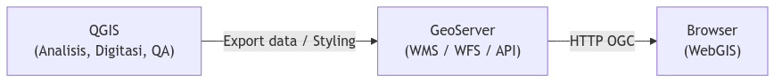
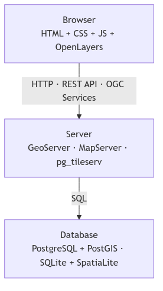
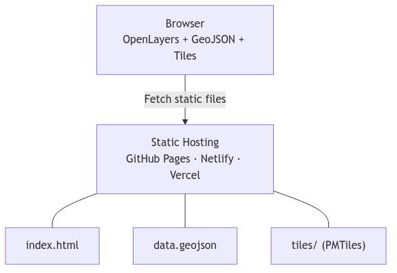

# Pembangunan SIG Web
## Dari Library ke Sistem: Membangun WebGIS Nyata

Program Sarjana Terapan Teknologi Survei dan Pemetaan Dasar
Departemen Teknologi Kebumian
Sekolah Vokasi, UGM

<hr>

**Ismail Sunni** | Geospatial Software Engineer | Camptocamp DE

---

# Presentasi Ini

[https://github.com/ismailsunni/web-gis-2026](https://github.com/ismailsunni/web-gis-2026)


---

# Recap: Apa yang Sudah Kalian Tahu

**Minggu 4:**
- JavaScript: variabel, fungsi, objek, OOP
- DOM manipulation & event listener
- Mini WebGIS dari nol (tanpa library)

**Minggu 5:**
- Pengenalan Leaflet & OpenLayers sebagai library
- Client-side scripting dengan library GIS

**Hari ini:** Naik level — dari *mengenal library* ke *membangun sistem*

---

# Tujuan Pembelajaran

Setelah sesi ini, mahasiswa mampu:

✅ Membandingkan **WebGIS vs Desktop GIS** secara mendalam
✅ Memilih **Maps API yang tepat** (Leaflet, Google, OpenLayers)
✅ Memahami strategi **publikasi & akses** peta interaktif di web
✅ Mengintegrasikan **data eksternal** (Google Sheets, WMS/WFS)
✅ Men-deploy WebGIS ke **GitHub Pages** atau **Vercel**

---

# Outline

1. **WebGIS vs Desktop GIS** — Perbandingan mendalam (2 slide)
2. **Arsitektur WebGIS** — Stack & komponen
3. **Ragam Maps API** — Leaflet, Google Maps, OpenLayers (3 slide)
4. **Perbandingan Detail** — Teknis & decision matrix (2 slide)
5. **Publikasi & Akses** — Platform, strategi, best practices
6. **MapLibre GL JS** — Web mapping generasi berikutnya
7. **Studi Kasus** — WebGIS di dunia nyata
8. **Refleksi & Tugas** — Takeaways & assignment

---

# 1️⃣ WebGIS vs Desktop GIS
## Lebih dari Sekadar "Bisa Online"

---

# Desktop GIS: Kekuatan Utama

## QGIS / ArcGIS Desktop / GRASS

- **Analisis spasial lengkap** — buffer, overlay, network analysis
- **Editing geometri** presisi tinggi
- **Cartographic production** — peta cetak berkualitas
- **Processing pipeline** — batch geoprocessing
- **Data format beragam** — Shapefile, GeoPackage, GDB, raster

**Desktop GIS = laboratorium analisis spasial**

---

# Web GIS: Kekuatan Utama

## Google Maps / Mapbox / Custom WebGIS

- **Zero install** — akses via URL, tidak perlu instalasi software
- **Multi-platform** — desktop, tablet, smartphone (responsive)
- **Kolaborasi real-time** — banyak user akses bersamaan tanpa konflik
- **Integrasi seamless** — embed di website, dashboard, CMS, aplikasi
- **Update sentral** — data berubah satu kali, semua user dapat update
- **Aksesibilitas** — publik bisa akses tanpa login atau izin khusus
- **Mobile-first** — optimized untuk penggunaan di lapangan via smartphone
- **Lightweight** — tidak butuh hardware canggih untuk client

**Web GIS = media komunikasi, distribusi, dan publikasi spasial**

---

# Perbandingan Mendalam - Part 1

| Aspek | Desktop GIS | Web GIS |
|---|---|---|
| **Analisis** | Lengkap (500+ tools) | Terbatas visualisasi & query |
| **Data size** | GB–TB lokal | MB–ratusan MB streaming |
| **CRS** | Semua CRS | Umumnya Web Mercator |
| **Rendering** | GPU lokal | Browser (Canvas/WebGL) |
| **Offline** | ✅ Penuh | ⚠️ Perlu caching |
| **Kolaborasi** | ❌ File-based | ✅ Real-time |

---

# Perbandingan Mendalam - Part 2

| Aspek | Desktop GIS | Web GIS |
|---|---|---|
| **Distribusi** | Email/FTP | Share URL instant |
| **Maintenance** | Update per mesin | 1× di server |
| **Learning curve** | Curam (~40 jam) | Ringan (~4 jam) |
| **Biaya** | Lisensi mahal | Mostly gratis |
| **User target** | GIS analyst | Publik/stakeholder |

---

# Hybrid Approach: Best of Both Worlds



**Workflow modern: Analisis di desktop → Publikasi di web**

---

# Kapan Pakai Yang Mana?

| Pilihan | Pakai Saat | Contoh |
|---|---|---|
| 🖥️ **Desktop GIS** | Analisis kompleks, editing presisi | Buffer, network, peta cetak |
| 🌐 **Web GIS** | Publikasi, dashboard, kolaborasi | Portal publik, monitoring |
| 🔄 **Hybrid** | Analisis + distribusi online | QGIS -> GeoServer -> WebGIS |

---

# 2️⃣ Arsitektur WebGIS
## Dari Database ke Browser

---

# Full Stack WebGIS



---

# Alternatif: Serverless WebGIS

Tidak semua WebGIS butuh backend!



**Gratis, cepat, tanpa server!**

---

# Format Data di WebGIS

| Format | Tipe | Cocok untuk |
|---|---|---|
| **GeoJSON** | Vektor | Fitur kecil–sedang (<10 MB) |
| **TopoJSON** | Vektor (compressed) | Fitur besar, batas wilayah |
| **XYZ Tiles** | Raster | Base map (OSM, satellite) |
| **PMTiles** | Vektor tiles | Offline / static hosting |
| **WMS** | Raster | Server-rendered map image |
| **WFS** | Vektor | Server feature access |
| **COG** | Raster (cloud) | Citra satelit besar |

---

# 3️⃣ Ragam Maps API
## Perbandingan & Pemilihan

---

# Maps API #1: Leaflet.js
## "Ringan & Cepat"

**Kelebihan utama:**
- Kecil, cepat dipelajari, banyak plugin
- Cocok untuk peta interaktif ringan

**Cocok untuk:**
- Website peta sederhana
- Dashboard monitoring
- Prototype cepat

**Biaya:** Gratis (open source)

---

# Maps API #2: Google Maps API
## "Siap Pakai & Powerful"

**Kelebihan utama:**
- Basemap premium dan data POI kuat
- Fitur siap pakai: Directions, Places, Street View

**Cocok untuk:**
- Aplikasi komersial
- Produk consumer (non-GIS user)
- Kebutuhan routing/geocoding cepat

**Biaya:** Berbayar (metered billing)

---

# Maps API #3: OpenLayers
## "Professional & Standard"

**Kelebihan utama:**
- Dukungan OGC native (WMS/WFS)
- Multi-CRS dan kontrol layer detail

**Cocok untuk:**
- Geoportal profesional
- Integrasi GeoServer/QGIS Server
- Dashboard spasial skala menengah-besar

**Biaya:** Gratis (open source)

---

# Framework Keputusan

| Kondisi Kebutuhan | API Disarankan |
|---|---|
| Belajar cepat, proyek sederhana | **Leaflet** |
| Perlu fitur Google siap pakai | **Google Maps API** |
| Perlu WMS/WFS, CRS kompleks, OGC | **OpenLayers** |

**Rule of thumb:** simple -> Leaflet, consumer app -> Google, GIS profesional -> OpenLayers.

---

# Leaflet vs Google Maps vs OpenLayers - Part 1

| Kriteria | Leaflet | Google Maps | OpenLayers |
|---|---|---|---|
| **Setup** | Import CDN | API key | Import CDN |
| **Learning curve** | Mudah (2–4 jam) | Mudah (2–4 jam) | Menengah (6–10 jam) |
| **Basemap** | Plugin | Built-in premium | Open (OSM/CARTO) |
| **Customization** | Baik | Terbatas | Sangat baik |
| **WMS/WFS** | Plugin/sulit | ❌ Tidak | ✅ Built-in |

---

# Leaflet vs Google Maps vs OpenLayers - Part 2

| Kriteria | Leaflet | Google Maps | OpenLayers |
|---|---|---|---|
| **Multi-CRS** | Dengan plugin | Mercator saja | ✅ Semua EPSG |
| **3D/Terrain** | ❌ | ✅ Ada | Limited |
| **Biaya** | Gratis | ~$7-10 per 1K | Gratis |
| **Offline** | SDK ada | ❌ Tidak | Dengan cache |

---

# Google Maps: Kapan Pakai?

✅ **Gunakan jika:**
- Aplikasi **commercial/berbayar**
- Target **non-GIS user** (consumer)
- Perlu **Street View** atau **Directions API**
- Budget ada untuk API cost

❌ **Hindari jika:**
- Data proyeksi custom (non-Web Mercator)
- Butuh WMS/WFS dari server pemetaan lokal
- Budget terbatas, traffic tinggi
- Perlu open source untuk compliance

---

# Contoh: Google Maps API

```javascript
const map = new google.maps.Map(document.getElementById('map'), {
    zoom: 14,
    center: { lat: -7.7956, lng: 110.3695 }
});

const marker = new google.maps.Marker({
    position: { lat: -7.7956, lng: 110.3695 },
    map: map,
    title: 'Yogyakarta'
});
```

**Keuntungan:** Instant, polished, banyak plugin
**Kerugian:** API key required, metered billing

---

# Leaflet vs OpenLayers: Teknis

| Aksi | Leaflet | OpenLayers |
|---|---|---|
| Buat peta | `L.map('map')` | `new ol.Map({target:'map'})` |
| Set view | `.setView([-7.79, 110.36], 13)` | `view: new ol.View({center, zoom})` |
| Tambah tile | `L.tileLayer(url).addTo(map)` | `new ol.layer.Tile({source:...})` |
| Marker | `L.marker([lat,lng])` | `new ol.Feature({geometry: Point})` |
| Popup | `.bindPopup(html)` | `new ol.Overlay({element:...})` |
| WMS | Plugin (sulit) | ✅ `ol.source.TileWMS` (mudah) |
| CRS lain | Dengan proj4 plugin | ✅ `ol.proj.fromLonLat()` native |

**Leaflet = ringkas & intuitif. OpenLayers = verbose tapi profesional.**

---

# 4️⃣ Hands-on: Praktik WebGIS dengan Strategi Publikasi
## Dari Local → Public dengan Akses Terkontrol

---

# Pilihan Skenario Praktik

## Opsi A (yang dipraktikkan di kelas)
- OpenLayers + Google Sheets
- Basemap switcher + filter kategori
- Deploy ke GitHub Pages

## Opsi B (pengembangan mandiri)
- Leaflet + API + autentikasi sederhana
- Deploy ke Vercel

**Fokus kelas:** Opsi A dulu, Opsi B untuk eksplorasi.

---

# Upgrade 1: WMS Layer dari Server OGC

OpenLayers bisa langsung konek ke GeoServer/QGIS Server/BIG.

```javascript
const wmsLayer = new ol.layer.Tile({
    source: new ol.source.TileWMS({
        url: 'https://geoserver.example.com/wms',
        params: {
            'LAYERS': 'nama:layer',
            'TILED': true
        },
        serverType: 'geoserver'
    })
});
map.addLayer(wmsLayer);
```

> Coba WMS publik: BIG, BMKG, atau GeoServer demo.

---

# Toggle Visibility Layer

```javascript
// Tombol toggle di HTML
// <button id="toggle-wms">Toggle WMS</button>

document.getElementById('toggle-wms').addEventListener('click', () => {
    wmsLayer.setVisible(!wmsLayer.getVisible());
});
```

Intinya: layer WMS bisa dihidupkan/dimatikan tanpa reload peta.

---

# Upgrade 2: Data dari Google Sheets

**Konsep:** Google Sheet publik → CSV → parse di JavaScript → OL Features

```
Google Sheet (isi data) → Publish as CSV → Fetch di JS → Buat Feature OL
```

**Setup Google Sheet:**

| nama | lon | lat | kategori | deskripsi |
|---|---|---|---|---|
| Tugu Yogya | 110.3672 | -7.7828 | landmark | Ikon kota |
| UGM | 110.3780 | -7.7703 | universitas | Kampus tertua |

---

# Fetch & Parse Google Sheets CSV

```javascript
const SHEET_CSV_URL =
  'https://docs.google.com/spreadsheets/d/ID/export?format=csv&gid=0';

async function loadFromSheet(url) {
    const res = await fetch(url);
    const text = await res.text();
    const rows = text.split('\n').slice(1); // skip header

    rows.forEach(row => {
        const [nama, lon, lat, kategori] = row.split(',');
        if (!lon || !lat) return;
        const feature = new ol.Feature({
            geometry: new ol.geom.Point(
                ol.proj.fromLonLat([parseFloat(lon), parseFloat(lat)])
            ),
            nama, kategori
        });
        markerSource.addFeature(feature);
    });
}
loadFromSheet(SHEET_CSV_URL);
```

---

# Upgrade 3: Filter Kategori

```html
<div id="filter">
    <button data-cat="all">Semua</button>
    <button data-cat="landmark">Landmark</button>
    <button data-cat="universitas">Universitas</button>
</div>
```

```javascript
document.querySelectorAll('#filter button').forEach(btn => {
    btn.addEventListener('click', () => {
        const cat = btn.dataset.cat;
        markerLayer.setStyle(feature => {
            if (cat === 'all' || feature.get('kategori') === cat) {
                return circleStyle(feature);
            }
            return null;
        });
    });
});
```

---

# 5️⃣ Strategi Publikasi & Akses Peta Interaktif

---

# Platform Publikasi WebGIS

| Platform | Untuk | Pro | Con |
|---|---|---|---|
| **GitHub Pages** 📂 | Static demo | Gratis, instant | No backend |
| **Vercel/Netlify** ☁️ | Serverless | Auto-deploy, fast | Limited free |
| **DigitalOcean/AWS** 🖥️ | Backend kompleks | Full control | Biaya, DevOps |
| **GeoServer** 🗺️ | Geoportal | GIS-native | Learning curve |

*Fokus kelas: GitHub Pages (A) & Vercel (B bonus)*

---

# 3 Skenario Publikasi

**Skenario 1:** Leaflet + GitHub Pages
→ Demo/portfolio, static, instant

**Skenario 2:** OpenLayers + Vercel
→ Dashboard real-time, auto-deploy

**Skenario 3:** GeoServer + PostGIS
→ Geoportal enterprise, powerful

---

# Akses Peta: 4 Model

| Level | Auth | Monitoring | Contoh |
|---|---|---|---|
| **🌍 Public** | ❌ | - | OpenStreetMap |
| **🔐 Login** | ✅ SSO | Tracking | Corp dashboard |
| **🛡️ API Key** | ✅ Key | Rate limit | Google Maps |
| **🔒 Enterprise** | ✅ Token | SLA | ArcGIS Online |

---

# Implementasi: Public WebGIS di GitHub Pages

```bash
# 1. Init repo lokal
git init
git add index.html app.js data/landmarks.geojson
git commit -m "WebGIS Yogyakarta - initial"

# 2. Buat repo di GitHub, lalu push
git remote add origin https://github.com/USERNAME/webgis-yogya.git
git push -u origin main

# 3. Aktifkan GitHub Pages
# Settings → Pages → Branch: main → Folder: root → Save

# 4. Tunggu ~1 menit, akses:
# https://USERNAME.github.io/webgis-yogya/
```

---

# Implementasi: Autentikasi + Backend (Vercel)

```javascript
// API endpoint: /api/landmarks?token=XXX
// Backend mengecek token sebelum return data

const token = localStorage.getItem('auth_token');
fetch(`/api/landmarks?token=${token}`)
    .then(r => r.json())
    .then(data => {
        data.features.forEach(f => {
            new L.Marker([f.geometry.coordinates[1], f.geometry.coordinates[0]])
                .bindPopup(f.properties.nama)
                .addTo(map);
        });
    });
```

---

# Best Practices: UX & Teknis

Checklist dasar publikasi:

- Mobile-friendly
- Ada loading dan pesan error
- Gunakan HTTPS
- Cantumkan sumber data (attribution)
- README berisi link demo

---

# Contoh Publikasi Nyata

### 📍 **Sheet Map** (Leaflet + Google Sheets + GitHub Pages)
Data publik → clustering → 100% client-side
🔗 [ismailsunni.id/map/sheet-map](https://ismailsunni.id/map/sheet-map/)

### 🛣️ **Route Finder** (OpenLayers + Backend API)
Node.js + PostgreSQL → DigitalOcean → rate limiting
🔗 [ismailsunni.id/map/route-finder](https://ismailsunni.id/map/route-finder/)

### 🗺️ **Geo Admin** (OGC Service + Geoportal)
Java + WMS/WMTS → 800+ layers → 3D view
🔗 [map.geo.admin.ch](https://map.geo.admin.ch)

---

# 7️⃣ Kenalan: MapLibre GL JS
## Selanjutnya Setelah OpenLayers

---

# Mengapa MapLibre GL JS?

OpenLayers dan Leaflet render peta sebagai **raster (Canvas)**.
MapLibre GL JS render dengan **WebGL** — beda kategori.

| | OpenLayers / Leaflet | MapLibre GL JS |
|---|---|---|
| Render | Canvas 2D | WebGL |
| Tiles | Raster (PNG) | Vector tiles (MVT) |
| 3D | ❌ | ✅ Terrain, buildings |
| Rotasi peta | Terbatas | ✅ Bebas |
| Animasi | Terbatas | ✅ Smooth |
| Style | JS | JSON style spec |

---

# MapLibre: Contoh Singkat

```javascript
const map = new maplibregl.Map({
    container: 'map',
    style: 'https://tiles.openfreemap.org/styles/liberty',
    center: [110.3695, -7.7956],
    zoom: 14,
    pitch: 45,      // tampilan miring (3D effect)
    bearing: -20    // rotasi peta
});

map.addControl(new maplibregl.NavigationControl());
```

**Kapan pakai MapLibre:** visualisasi 3D, animasi data, vektor tiles skala besar

> 🔗 maplibre.org — open source, gratis, aktif dikembangkan

---

# 8️⃣ Studi Kasus
## WebGIS di Dunia Nyata

---

# Studi Kasus: map.geo.admin.ch

🇨🇭 **Geoportal nasional Swiss** — dibangun dengan OpenLayers

Fitur:
- 800+ layer data nasional
- 2D dan 3D view
- WMS/WMTS dari swisstopo
- Pencarian alamat & koordinat
- Cetak peta & share URL
- Open source!

🔗 [map.geo.admin.ch](https://map.geo.admin.ch)

---

# Studi Kasus: Peta Interaktif Routing

🛣️ **Route Finder** — contoh WebGIS dengan routing nyata

Fitur:
- Pencarian lokasi (Photon geocoding)
- Routing jalan nyata via pgRouting
- TSP solver (Held-Karp)
- Multiple kota (Yogyakarta & München)

🔗 [ismailsunni.id/map/route-finder](https://ismailsunni.id/map/route-finder/)

*Dibangun dengan OpenLayers + Supabase + PostgreSQL*

---

# Studi Kasus: Peta dari Google Sheet

📊 **Sheet Map** — WebGIS tanpa backend, data dari spreadsheet

Fitur:
- Data dari Google Sheet publik
- Clustering otomatis
- Warna per kategori
- Zero server — 100% client-side

🔗 [ismailsunni.id/map/sheet-map](https://ismailsunni.id/map/sheet-map/)

*Cocok untuk: survei lapangan, data crowdsource, tugas mahasiswa*

---

# 9️⃣ Refleksi & Tugas

---

# Refleksi

🤔 Kapan sebaiknya pakai Desktop vs Web GIS?
🤔 Kapan WMS lebih baik daripada GeoJSON langsung?
🤔 Apa keuntungan load data dari Google Sheets vs hardcode?
🤔 Mengapa MapLibre berbeda kategori dari Leaflet/OpenLayers?

---

# Key Takeaways

1. Desktop GIS = **analisis**, Web GIS = **komunikasi & distribusi**
2. OpenLayers unggul di **OGC standards** — WMS/WFS, multi-CRS, native
3. **Google Sheets → CSV** = cara cepat punya backend data tanpa server
4. **Serverless WebGIS** bisa sangat powerful (GeoJSON + GitHub Pages)
5. MapLibre GL JS = WebGL rendering, vector tiles, 3D — generasi berikutnya

---

# 📋 Latihan Mandiri

Silakan pilih salah satu atau kombinasikan:

1. Bangun WebGIS dengan Leaflet/OpenLayers + data Google Sheets
2. Tambahkan 2 basemap + filter kategori
3. Deploy ke GitHub Pages
4. Coba integrasi 1 layer WMS publik
5. (Opsional) Coba deploy versi dengan autentikasi sederhana di Vercel

**Keluaran latihan:** link repo + link demo + screenshot.

---

# 📚 Referensi

- [OpenLayers Quick Start](https://openlayers.org/doc/quickstart.html)
- [OpenLayers Examples](https://openlayers.org/en/latest/examples/)
- [MapLibre GL JS Docs](https://maplibre.org/maplibre-gl-js/docs/)
- [GitHub Pages Docs](https://pages.github.com/)
- [GeoJSON.io](https://geojson.io/) — buat GeoJSON interaktif
- [ina-geoportal.go.id](https://tanahair.indonesia.go.id/portal-web) — WMS BIG
- [Map Collection](https://ismailsunni.id/map/) — contoh proyek nyata
- [This presentation](https://github.com/ismailsunni/web-gis-2026)

> Eksplorasi dan bawa pertanyaan ke sesi berikutnya!
