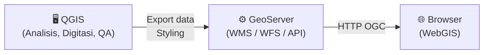
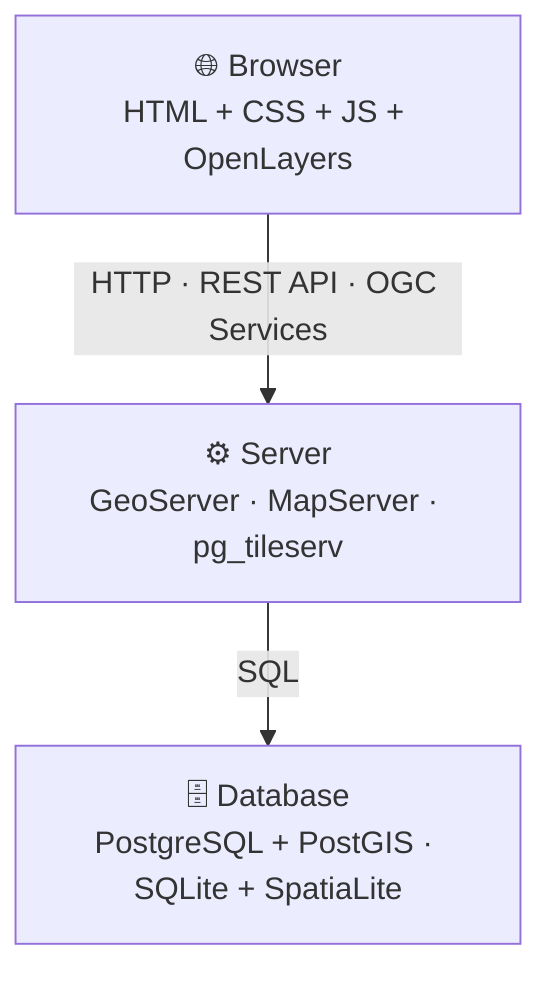
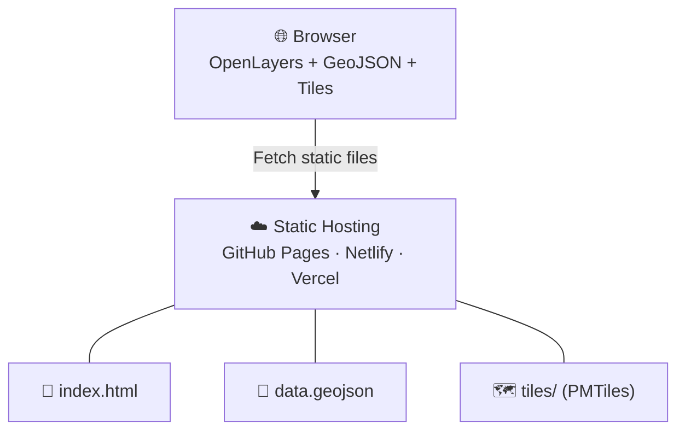
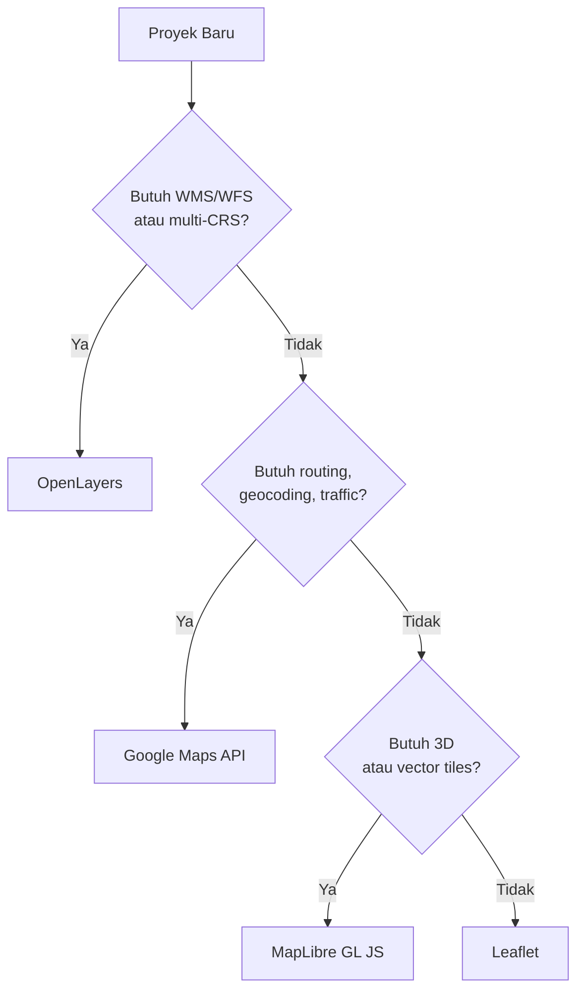
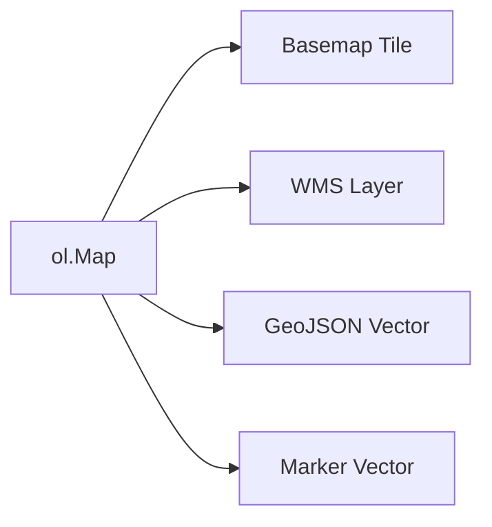

# Pembangunan SIG Web
## Dari Library ke Sistem: Membangun WebGIS Nyata

Program Sarjana Terapan Teknologi Survei dan Pemetaan Dasar
Departemen Teknologi Kebumian
Sekolah Vokasi, UGM

<hr>

**Ismail Sunni** | Geospatial Software Engineer | Camptocamp DE

---

# Presentasi Ini

[https://github.com/ismailsunni/web-gis-2026](https://github.com/ismailsunni/web-gis-2026)


---

# Recap: Apa yang Sudah Kalian Tahu

**Minggu 4:**
- JavaScript: variabel, fungsi, objek, OOP
- DOM manipulation & event listener
- Mini WebGIS dari nol (tanpa library)

**Minggu 5:**
- Pengenalan Leaflet & OpenLayers sebagai library
- Client-side scripting dengan library GIS

**Hari ini:** Naik level — dari *mengenal library* ke *membangun sistem*

---

# Tujuan Pembelajaran

Setelah sesi ini, mahasiswa mampu:

✅ Membandingkan **WebGIS vs Desktop GIS** secara mendalam
✅ Memilih **Maps API yang tepat** untuk kasus nyata
✅ Mengintegrasikan **layer WMS/WFS** dari server OGC
✅ Memuat data dari **sumber eksternal** (Google Sheets, GeoJSON URL)
✅ Men-deploy WebGIS ke **GitHub Pages** secara langsung

---

# Outline

1. **WebGIS vs Desktop GIS** — Perbandingan mendalam
2. **Arsitektur WebGIS** — Stack & komponen
3. **Pilih Maps API yang Tepat** — Framework keputusan
4. **Hands-on: Upgrade WebGIS** — WMS, data eksternal, filter
5. **Deploy Live** — GitHub Pages step-by-step
6. **Kenalan: MapLibre GL JS** — Selanjutnya
7. **Studi Kasus** — WebGIS di dunia nyata
8. **Refleksi & Tugas**

---

# 1️⃣ WebGIS vs Desktop GIS
## Lebih dari Sekadar "Bisa Online"

---

# Desktop GIS: Kekuatan Utama

## QGIS / ArcGIS Desktop / GRASS

- **Analisis spasial lengkap** — buffer, overlay, network analysis
- **Editing geometri** presisi tinggi
- **Cartographic production** — peta cetak berkualitas
- **Processing pipeline** — batch geoprocessing
- **Data format beragam** — Shapefile, GeoPackage, GDB, raster

**Desktop GIS = laboratorium analisis spasial**

---

# Web GIS: Kekuatan Utama

## Google Maps / Mapbox / Custom WebGIS

- **Zero install** — akses via URL
- **Multi-platform** — desktop, tablet, HP
- **Kolaborasi real-time** — banyak user bersamaan
- **Integrasi** — embed di website, dashboard, CMS
- **Update sentral** — data berubah, semua user dapat

**Web GIS = media komunikasi & distribusi spasial**

---

# Perbandingan Mendalam

| Aspek | Desktop GIS | Web GIS |
|---|---|---|
| **Analisis** | Lengkap (500+ tools) | Terbatas (client-side) |
| **Data size** | GB–TB lokal | MB–ratusan MB streaming |
| **CRS** | Semua CRS | Umumnya Web Mercator |
| **Rendering** | GPU lokal | Browser (Canvas/WebGL) |
| **Offline** | ✅ Penuh | ⚠️ Terbatas |
| **Kolaborasi** | ❌ File-based | ✅ Real-time |
| **Distribusi** | Email/FTP file | Share URL |
| **Maintenance** | Update per mesin | Update 1× di server |

---

# Hybrid Approach: Best of Both Worlds



**Workflow modern: Analisis di desktop → Publikasi di web**

---

# Kapan Pakai Yang Mana?

## 🖥️ Desktop GIS:
- Analisis kompleks (interpolasi, network, 3D)
- Digitasi presisi
- Peta cetak / kartografi

## 🌐 Web GIS:
- Dashboard monitoring
- Informasi publik
- Kolaborasi tim
- Aplikasi mobile/field

## 🔄 Hybrid:
- Analisis di QGIS → publish ke GeoServer → tampilkan di WebGIS

---

# 2️⃣ Arsitektur WebGIS
## Dari Database ke Browser

---

# Full Stack WebGIS



---

# Alternatif: Serverless WebGIS

Tidak semua WebGIS butuh backend!



**Gratis, cepat, tanpa server!**

---

# Format Data di WebGIS

| Format | Tipe | Cocok untuk |
|---|---|---|
| **GeoJSON** | Vektor | Fitur kecil–sedang (<10 MB) |
| **TopoJSON** | Vektor (compressed) | Fitur besar, batas wilayah |
| **XYZ Tiles** | Raster | Base map (OSM, satellite) |
| **PMTiles** | Vektor tiles | Offline / static hosting |
| **WMS** | Raster | Server-rendered map image |
| **WFS** | Vektor | Server feature access |
| **COG** | Raster (cloud) | Citra satelit besar |

---

# 3️⃣ Pilih Maps API yang Tepat

---

# Framework Keputusan



---

# Leaflet vs OpenLayers: Side-by-Side

| Aksi | Leaflet | OpenLayers |
|---|---|---|
| Buat peta | `L.map('map')` | `new ol.Map({target:'map'})` |
| Set view | `.setView([-7.79, 110.36], 13)` | `view: new ol.View({center, zoom})` |
| Tambah tile | `L.tileLayer(url).addTo(map)` | `new ol.layer.Tile({source:...})` |
| Marker | `L.marker([lat,lng])` | `new ol.Feature({geometry: Point})` |
| Popup | `.bindPopup(html)` | `new ol.Overlay({element:...})` |
| WMS | Plugin | ✅ `ol.source.TileWMS` built-in |
| CRS lain | Plugin | ✅ `ol.proj` + proj4 built-in |

**Leaflet = ringkas. OpenLayers = eksplisit, GIS-grade, OGC-native.**

---

# 4️⃣ Hands-on: Upgrade WebGIS
## Dari Pengenalan ke Sistem Nyata

---

# Yang Sudah Ada (Minggu 5)

```javascript
const map = new ol.Map({
    target: 'map',
    layers: [ new ol.layer.Tile({ source: new ol.source.OSM() }) ],
    view: new ol.View({
        center: ol.proj.fromLonLat([110.3695, -7.7956]),
        zoom: 14
    })
});
```

**Hari ini kita tambahkan:**
1. Layer WMS dari server OGC
2. Data dari Google Sheets (sumber eksternal)
3. Filter kategori interaktif
4. Deploy langsung ke GitHub Pages

---

# Upgrade 1: WMS Layer dari Server OGC

OpenLayers bisa langsung bicara dengan GeoServer, QGIS Server, BIG, dsb.

```javascript
const wmsLayer = new ol.layer.Tile({
    source: new ol.source.TileWMS({
        url: 'https://geoserver.example.com/wfs',
        params: {
            'LAYERS': 'nama:layer',
            'TILED': true,
            'FORMAT': 'image/png',
            'TRANSPARENT': true
        },
        serverType: 'geoserver'
    }),
    opacity: 0.7
});
map.addLayer(wmsLayer);
```

> 💡 Coba dengan WMS publik: BIG (ina-geoportal.go.id), BMKG, atau GeoServer demo

---

# Toggle Visibility Layer

```javascript
// Tombol toggle di HTML
// <button id="toggle-wms">Toggle WMS</button>

document.getElementById('toggle-wms').addEventListener('click', () => {
    wmsLayer.setVisible(!wmsLayer.getVisible());
});
```

Struktur layer dalam OpenLayers:



---

# Upgrade 2: Data dari Google Sheets

**Konsep:** Google Sheet publik → CSV → parse di JavaScript → OL Features

```
Google Sheet (isi data) → Publish as CSV → Fetch di JS → Buat Feature OL
```

**Setup Google Sheet:**

| nama | lon | lat | kategori | deskripsi |
|---|---|---|---|---|
| Tugu Yogya | 110.3672 | -7.7828 | landmark | Ikon kota |
| UGM | 110.3780 | -7.7703 | universitas | Kampus tertua |

---

# Fetch & Parse Google Sheets CSV

```javascript
const SHEET_CSV_URL =
  'https://docs.google.com/spreadsheets/d/ID/export?format=csv&gid=0';

async function loadFromSheet(url) {
    const res = await fetch(url);
    const text = await res.text();
    const rows = text.split('\n').slice(1); // skip header

    rows.forEach(row => {
        const [nama, lon, lat, kategori, deskripsi] = row.split(',');
        if (!lon || !lat) return;

        const feature = new ol.Feature({
            geometry: new ol.geom.Point(
                ol.proj.fromLonLat([parseFloat(lon), parseFloat(lat)])
            ),
            nama, kategori, deskripsi
        });
        markerSource.addFeature(feature);
    });
}

loadFromSheet(SHEET_CSV_URL);
```

---

# Upgrade 3: Filter Kategori

```html
<!-- Tambah di HTML -->
<div id="filter">
    <button data-cat="all">Semua</button>
    <button data-cat="landmark">Landmark</button>
    <button data-cat="universitas">Universitas</button>
</div>
```

```javascript
document.querySelectorAll('#filter button').forEach(btn => {
    btn.addEventListener('click', () => {
        const cat = btn.dataset.cat;
        markerLayer.setStyle(feature => {
            if (cat === 'all' || feature.get('kategori') === cat) {
                return circleStyle(feature);   // tampilkan
            }
            return null;  // sembunyikan
        });
    });
});
```

---

# 5️⃣ Deploy Live ke GitHub Pages

---

# Langkah Deploy (Sekarang, Bersama)

```bash
# 1. Init repo (kalau belum)
git init
git add index.html app.js
git commit -m "WebGIS Yogyakarta - initial"

# 2. Buat repo di GitHub, lalu push
git remote add origin https://github.com/USERNAME/webgis-yogya.git
git push -u origin main

# 3. Aktifkan Pages
# GitHub → Settings → Pages → Source: main / root → Save

# 4. Tunggu ~1 menit, akses di:
# https://USERNAME.github.io/webgis-yogya/
```

---

# Tips Publikasi Profesional

1. **README.md** — sertakan screenshot + link demo
2. **Responsive** — test di mobile (DevTools → toggle device)
3. **CORS** — data eksternal harus mengizinkan cross-origin fetch
4. **HTTPS** — GitHub Pages sudah otomatis; WMS juga harus HTTPS
5. **Attributions** — cantumkan sumber data, library, dan lisensi
6. **Loading speed** — pakai CDN, compress GeoJSON besar

---

# 6️⃣ Kenalan: MapLibre GL JS
## Selanjutnya Setelah OpenLayers

---

# Mengapa MapLibre GL JS?

OpenLayers dan Leaflet render peta sebagai **raster (Canvas)**.
MapLibre GL JS render dengan **WebGL** — beda kategori.

| | OpenLayers / Leaflet | MapLibre GL JS |
|---|---|---|
| Render | Canvas 2D | WebGL |
| Tiles | Raster (PNG) | Vector tiles (MVT) |
| 3D | ❌ | ✅ Terrain, buildings |
| Rotasi peta | Terbatas | ✅ Bebas |
| Animasi | Terbatas | ✅ Smooth |
| Style | JS | JSON style spec |

---

# MapLibre: Contoh Singkat

```javascript
const map = new maplibregl.Map({
    container: 'map',
    style: 'https://tiles.openfreemap.org/styles/liberty',
    center: [110.3695, -7.7956],
    zoom: 14,
    pitch: 45,      // tampilan miring (3D effect)
    bearing: -20    // rotasi peta
});

map.addControl(new maplibregl.NavigationControl());
```

**Kapan pakai MapLibre:** visualisasi 3D, animasi data, vektor tiles skala besar

> 🔗 maplibre.org — open source, gratis, aktif dikembangkan

---

# 7️⃣ Studi Kasus
## WebGIS di Dunia Nyata

---

# Studi Kasus: map.geo.admin.ch

🇨🇭 **Geoportal nasional Swiss** — dibangun dengan OpenLayers

Fitur:
- 800+ layer data nasional
- 2D dan 3D view
- WMS/WMTS dari swisstopo
- Pencarian alamat & koordinat
- Cetak peta & share URL
- Open source!

🔗 [map.geo.admin.ch](https://map.geo.admin.ch)

---

# Studi Kasus: Peta Interaktif Routing

🛣️ **Route Finder** — contoh WebGIS dengan routing nyata

Fitur:
- Pencarian lokasi (Photon geocoding)
- Routing jalan nyata via pgRouting
- TSP solver (Held-Karp)
- Multiple kota (Yogyakarta & München)

🔗 [ismailsunni.id/map/route-finder](https://ismailsunni.id/map/route-finder/)

*Dibangun dengan OpenLayers + Supabase + PostgreSQL*

---

# Studi Kasus: Peta dari Google Sheet

📊 **Sheet Map** — WebGIS tanpa backend, data dari spreadsheet

Fitur:
- Data dari Google Sheet publik
- Clustering otomatis
- Warna per kategori
- Zero server — 100% client-side

🔗 [ismailsunni.id/map/sheet-map](https://ismailsunni.id/map/sheet-map/)

*Cocok untuk: survei lapangan, data crowdsource, tugas mahasiswa*

---

# 8️⃣ Refleksi & Tugas

---

# Refleksi

🤔 Kapan sebaiknya pakai Desktop vs Web GIS?
🤔 Kapan WMS lebih baik daripada GeoJSON langsung?
🤔 Apa keuntungan load data dari Google Sheets vs hardcode?
🤔 Mengapa MapLibre berbeda kategori dari Leaflet/OpenLayers?

---

# Key Takeaways

1. Desktop GIS = **analisis**, Web GIS = **komunikasi & distribusi**
2. OpenLayers unggul di **OGC standards** — WMS/WFS, multi-CRS, native
3. **Google Sheets → CSV** = cara cepat punya backend data tanpa server
4. **Serverless WebGIS** bisa sangat powerful (GeoJSON + GitHub Pages)
5. MapLibre GL JS = WebGL rendering, vector tiles, 3D — generasi berikutnya

---

# 📋 Tugas

Buat **WebGIS interaktif** dengan ketentuan:

1. Gunakan **OpenLayers**
2. Tampilkan **minimal 5 lokasi** dari **Google Sheets** (bukan hardcode)
3. **Minimal 2 base map** dengan switcher
4. Tambahkan **filter kategori** (minimal 2 kategori)
5. *(Bonus)* Integrasikan **layer WMS** dari sumber publik
6. *(Bonus)* Tambahkan **hover tooltip** & click popup
7. **Deploy ke GitHub Pages**
8. Kumpulkan: **link repo + link demo**

---

# 📚 Referensi

- [OpenLayers Quick Start](https://openlayers.org/doc/quickstart.html)
- [OpenLayers Examples](https://openlayers.org/en/latest/examples/)
- [MapLibre GL JS Docs](https://maplibre.org/maplibre-gl-js/docs/)
- [GitHub Pages Docs](https://pages.github.com/)
- [GeoJSON.io](https://geojson.io/) — buat GeoJSON interaktif
- [ina-geoportal.go.id](https://tanahair.indonesia.go.id/portal-web) — WMS BIG
- [Map Collection](https://ismailsunni.id/map/) — contoh proyek nyata
- [This presentation](https://github.com/ismailsunni/web-gis-2026)

> Eksplorasi dan bawa pertanyaan ke sesi berikutnya!
